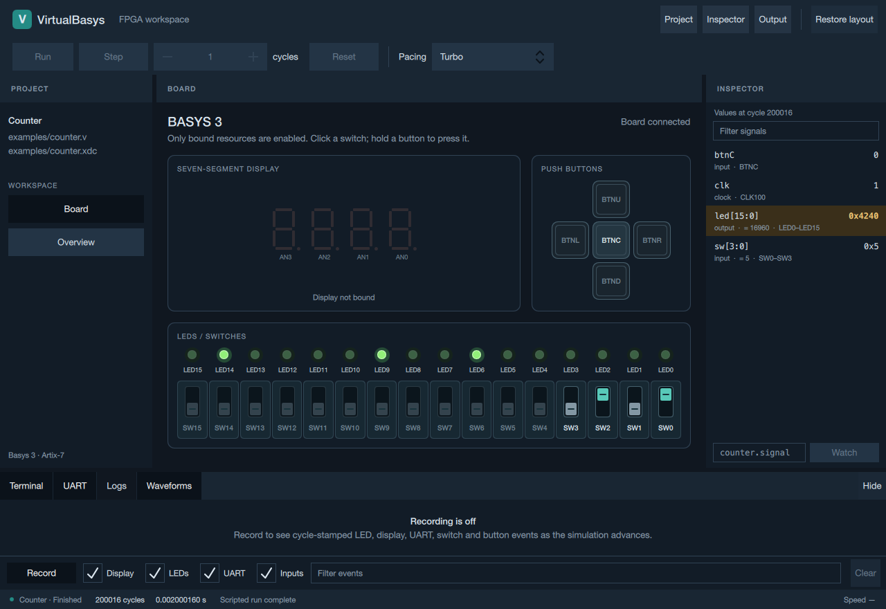
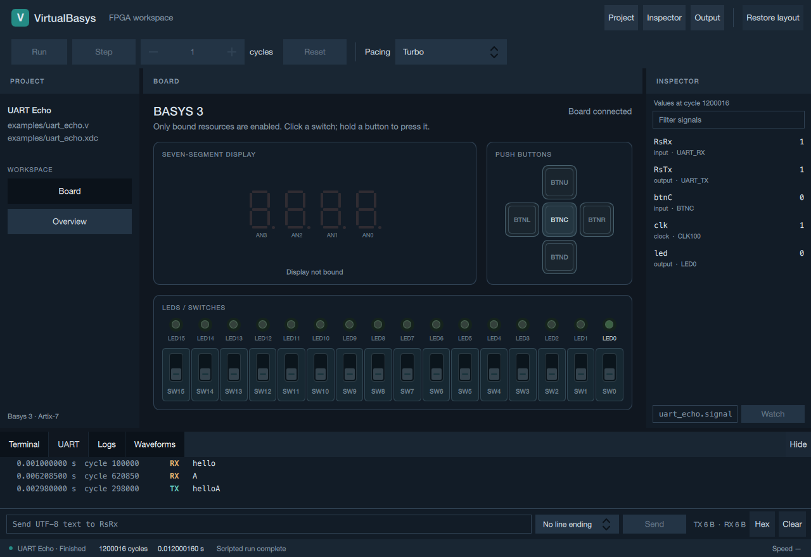
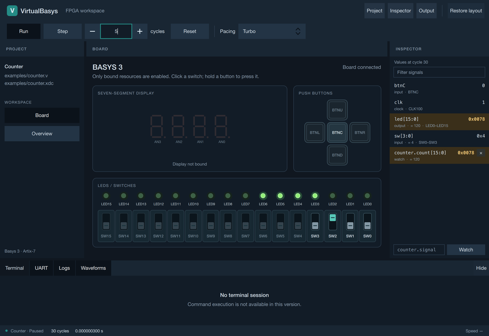
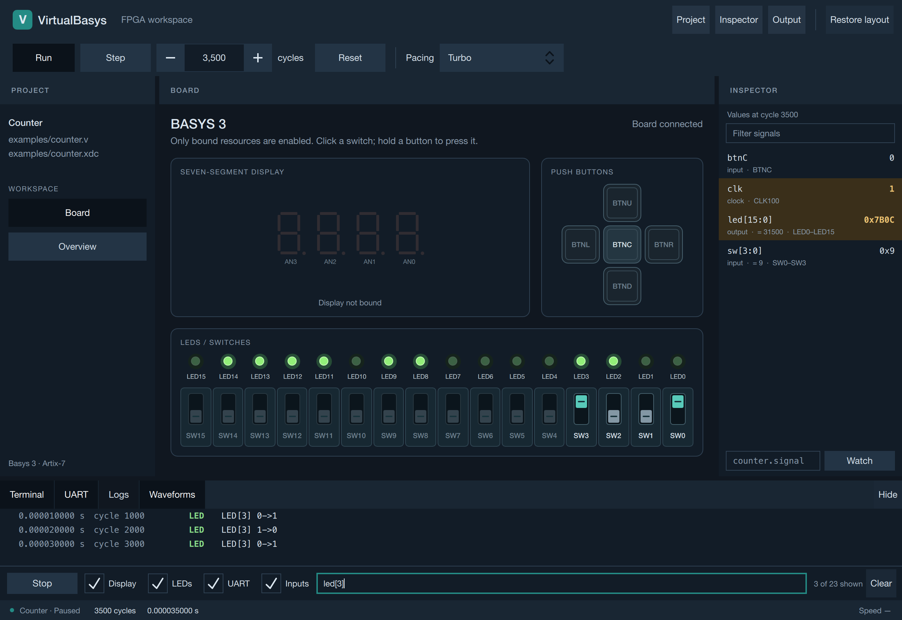
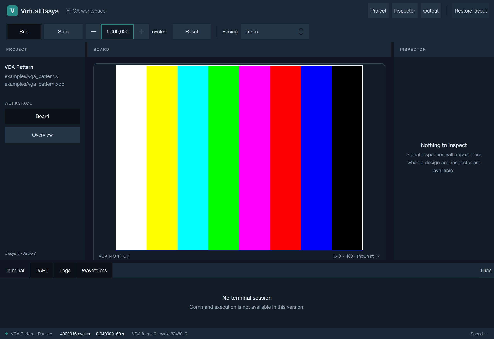
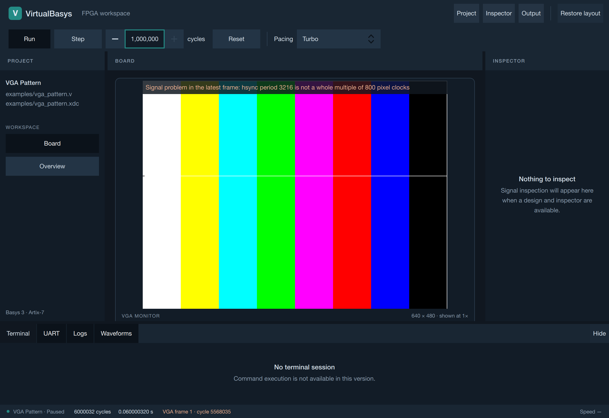
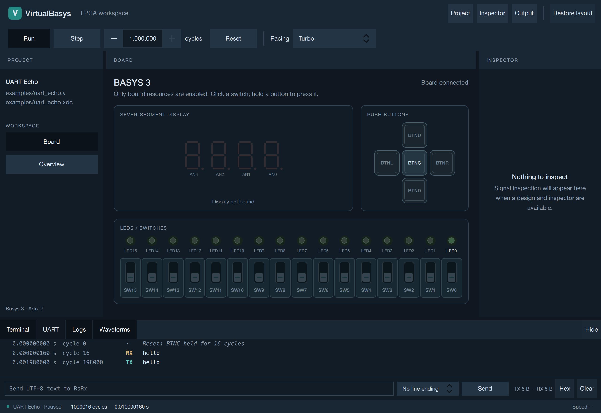
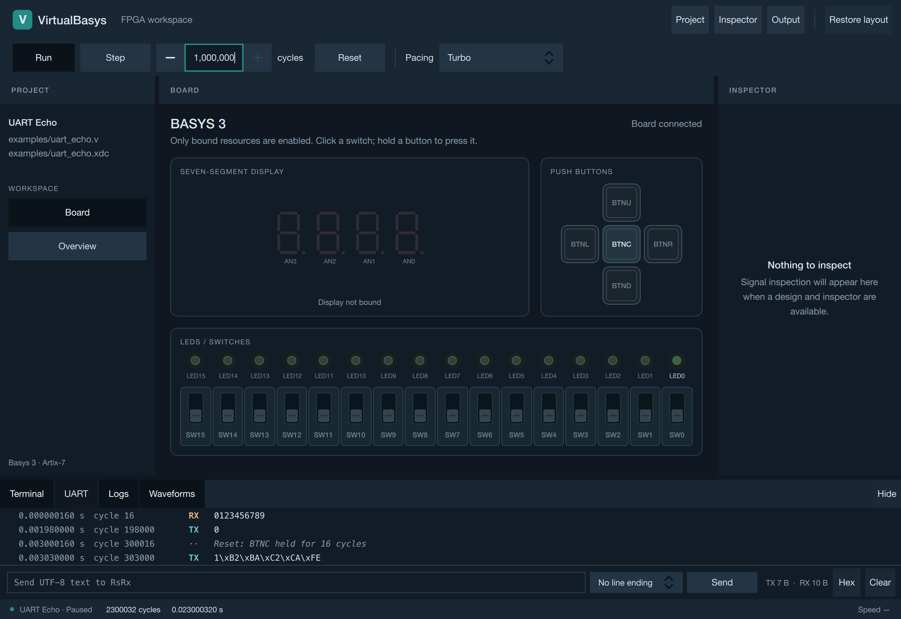
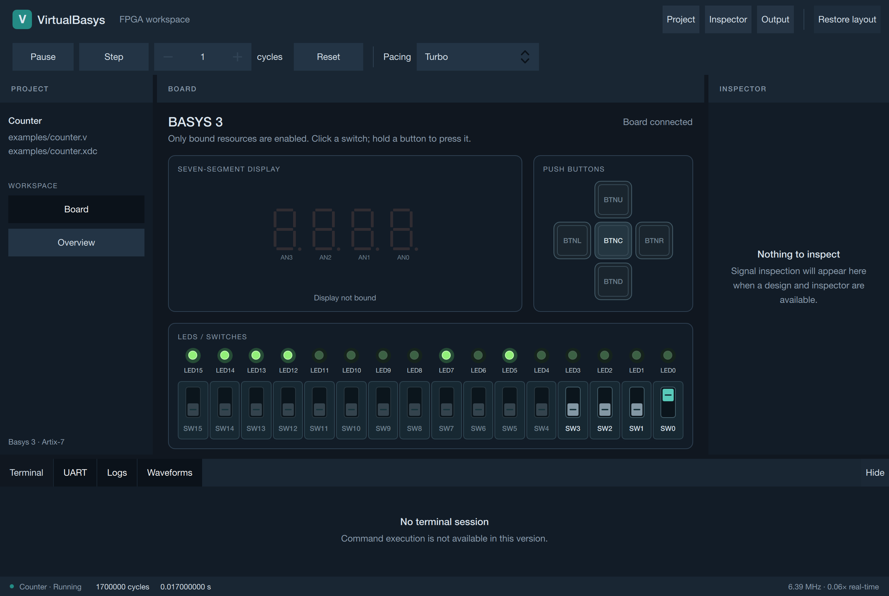
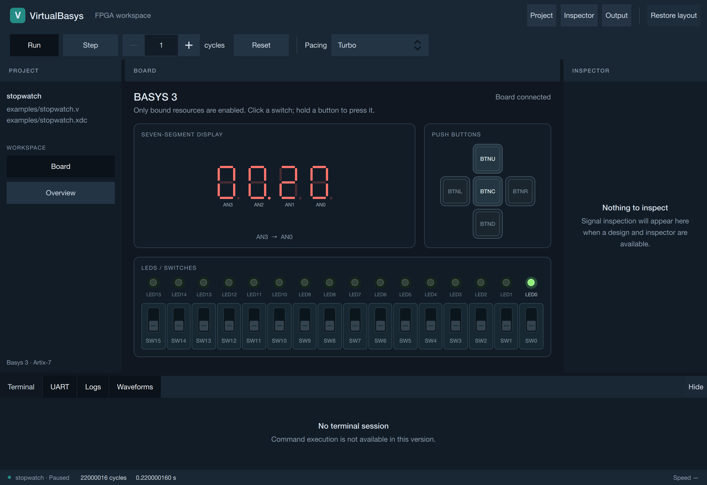

# VirtualBasys

A virtual Basys 3 FPGA board for running Verilog designs without hardware.
Built with **C++20 and Verilator** for macOS, with a **Qt 6 / Qt Quick** frontend.

## Current progress

| Area | Status |
| --- | --- |
| Simulator | Working XDC pin bindings, switches, LEDs, buttons, seven-segment display, UART, VGA, VCD traces and regression tests. Counter, stopwatch, UART echo and VGA pattern examples are included. |
| Qt frontend — M0–M8 complete | Counter, stopwatch, UART echo and VGA pattern launchers, resizable workspace, board controls, Run/Pause/Step/Reset, exact virtual time and measured speed. Turbo and best-effort real-time pacing. UART terminal with cycle-stamped TX/RX rows, send, hex view, clear and bounded scrollback. Pixel-exact VGA monitor showing each completed frame with its cycle and the monitor's signal diagnosis. Signal inspector with pin bindings, change highlighting and RTL watches; filterable, cycle-stamped event log. Scripted runs (`--frames`, `--at`, `--switches`, `--send`, `--log`, `--screenshot`, `--xdc`). |
| Migration — complete | The earlier Dear ImGui/SDL2 frontend was removed in M8 after its scripted runs were matched byte for byte. Next: loading arbitrary designs. |

**Qt runs all four built-in examples**, each in its own launcher, interactively
or as reproducible scripted runs. Loading arbitrary designs is still pending.

M8 verification: **44/44 full-suite checks**, **18/18 headless checks** and
**26/26 Qt sanitizer checks** without the legacy frontend. Before its removal,
the Qt launchers wrote byte-identical logs to the ImGui demos for the same scripts.
[Scripted runs](docs/qt_scripted_runs.md) · [Inspector and log](docs/qt_inspector_log.md) · [VGA monitor](docs/qt_vga.md) ·
[UART terminal](docs/qt_uart.md) · [Simulation controls](docs/qt_control.md) ·
[Roadmap](docs/migration_plan.md)

## Screenshots

| Scripted counter run at its last cycle | Scripted UART sends and their echoes |
| --- | --- |
|  |  |

Captured by the native simulation and UART UI tests. Scripted runs set inputs
and send text at exact cycles, stop at their last cycle and write the same logs
as the removed ImGui demos did.

| Inspector with an RTL watch | Event log filtered to one LED |
| --- | --- |
|  |  |

Captured by the native inspector UI test running the real `counter` RTL. The
inspector's values all come from one snapshot, and the highlighted rows changed
in the last step. The log rows are the board's own structured log.

| VGA pattern in the Qt monitor | Monitor diagnosis after a mid-frame reset |
| --- | --- |
|  |  |

Captured by the native VGA UI test running the real `vga_pattern` RTL. In the
second image a reset interrupted the frame, and the monitor reports the uneven
line period until the next clean frame.

| UART echo in the Qt terminal | Reset during UART traffic |
| --- | --- |
|  |  |

Captured by the native UART UI test running the real `uart_echo` RTL. The second
image shows the design echoing unexpected bytes after a reset interrupts its
frames; the terminal shows exactly what the board decoded.

| Counter running in Qt | Stopwatch paused after simulation |
| --- | --- |
|  |  |

Captured in M4 from the real counter UI test and the stopwatch benchmark.

## Build and run

On macOS with Xcode Command Line Tools and Homebrew, run from the repository root:

```sh
brew install cmake verilator qtbase qtdeclarative
cmake -S . -B build/qt -DVB_BUILD_QT_GUI=ON
cmake --build build/qt -j 8
./build/qt/src/qt/virtualbasys_qt
./build/qt/src/qt/virtualbasys_qt_stopwatch
./build/qt/src/qt/virtualbasys_qt_uart
./build/qt/src/qt/virtualbasys_qt_vga
```

All start paused. Reset applies a 16-cycle board reset; virtual time continues.
The UART and VGA launchers apply that reset once at startup, because their
designs need it (they open at cycle 16). Type in the UART tab, press Return,
then Run or Step. The VGA monitor shows its first frame after about 3.25 million
cycles.
Use `--preview` for the unloaded board or `--realtime` for best-effort 1× pacing.

Scripted runs apply inputs at exact cycles, run by themselves and can write a
log and a screenshot; see [scripted runs](docs/qt_scripted_runs.md):

```sh
./build/qt/src/qt/virtualbasys_qt_stopwatch --frames 300 \
  --at 100000:BTNU=1 --at 1300000:BTNU=0 --log stopwatch.log --screenshot stopwatch.png
```

Run tests with `ctest --test-dir build/qt --output-on-failure`.
The optional Surfer VCD check is skipped unless `surfer` is installed.
See the [build and testing guide](docs/qt_build.md) for frontend options and the
[board guide](docs/qt_board.md) for controls and screenshot reproduction.
