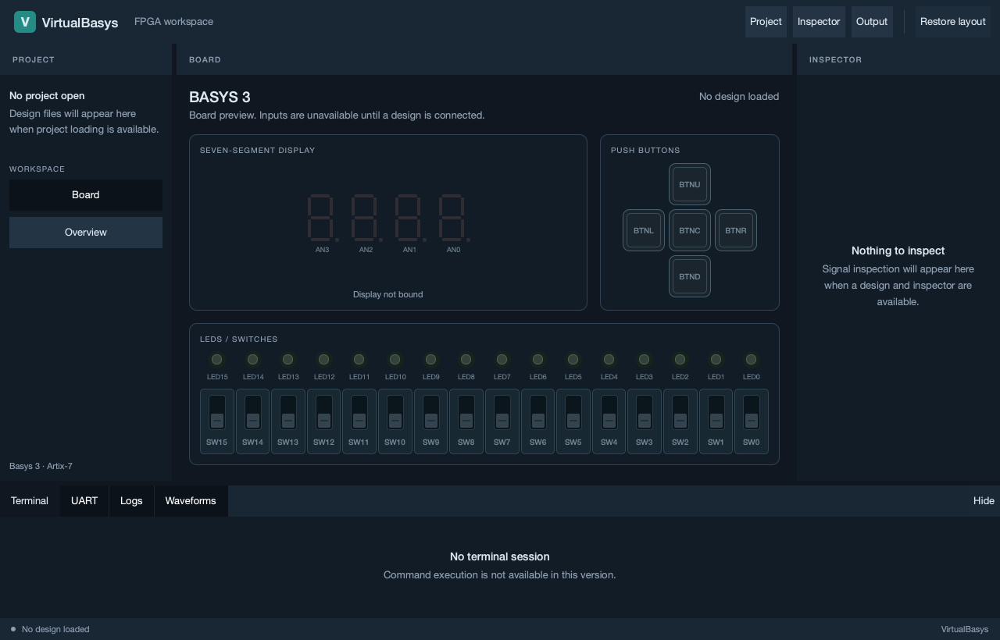
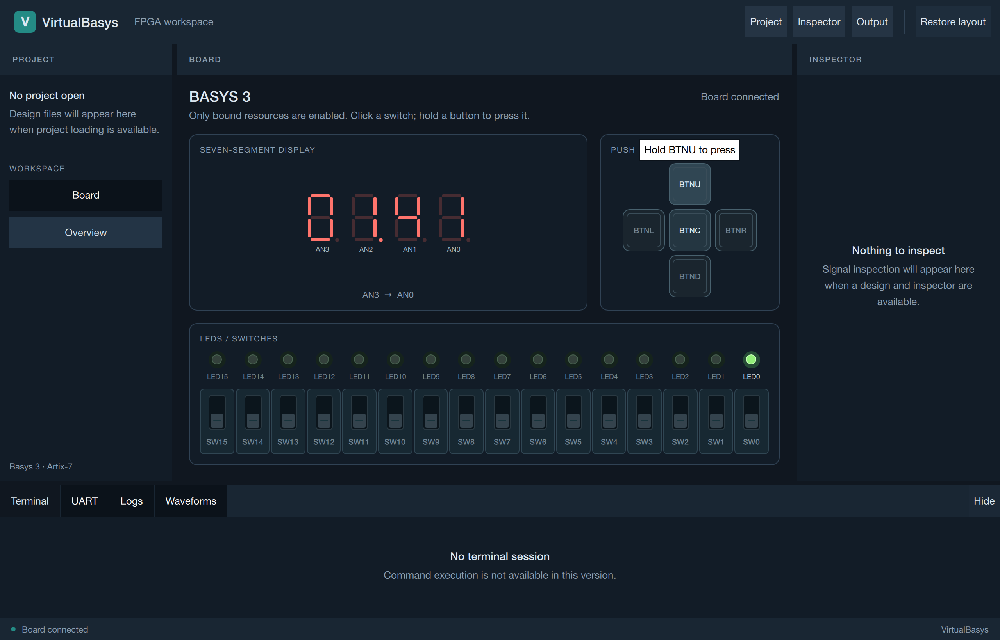

# VirtualBasys

A virtual Basys 3 FPGA board for running Verilog designs without hardware.
Built with **C++20 and Verilator** for macOS; migration to **Qt 6 / Qt Quick** is in progress.

## Current progress

| Area | Status |
| --- | --- |
| Simulator | Working XDC pin bindings, switches, LEDs, buttons, seven-segment display, UART, VGA, VCD traces and regression tests. Counter, stopwatch, UART echo and VGA pattern examples are included. |
| Qt frontend — M0–M3 complete | Application shell, resizable panels and reusable board controls: 16 switches, 16 LEDs, 5 buttons and 4 display digits. Connected counter and stopwatch behavior is verified in integration tests. |
| Next — M4 | Load examples and add run/pause/step/reset, virtual time, measured throughput and pacing. |

**The Qt launcher currently opens a disabled board preview.** Design loading and
simulation controls are pending; Qt UART, VGA, inspector and log views follow in
later milestones. The existing ImGui demos remain available for interactive use.

M3 verification: **25/25 full-suite checks**, **18/18 headless checks** and
**7/7 Qt sanitizer checks** passed, with independent review.
[Verification details](docs/qt_board.md#verification) · [Roadmap](docs/migration_plan.md)

## Screenshots

| Current Qt launcher — disabled preview | Qt stopwatch — connected integration test, showing 01.41 |
| --- | --- |
|  |  |

The connected screenshot comes from the test harness; the launcher does not yet load designs.

## Build and run the Qt preview

On macOS with Xcode Command Line Tools and Homebrew, run from the repository root:

```sh
brew install cmake verilator qtbase qtdeclarative
cmake -S . -B build/qt -DVB_BUILD_QT_GUI=ON -DVB_BUILD_GUI=OFF
cmake --build build/qt -j 8
./build/qt/src/qt/virtualbasys_qt
```

Run tests with `ctest --test-dir build/qt --output-on-failure`.
The optional Surfer VCD check is skipped unless `surfer` is installed.
See the [build and testing guide](docs/qt_build.md) for frontend options and the
[board guide](docs/qt_board.md) for controls and screenshot reproduction.
