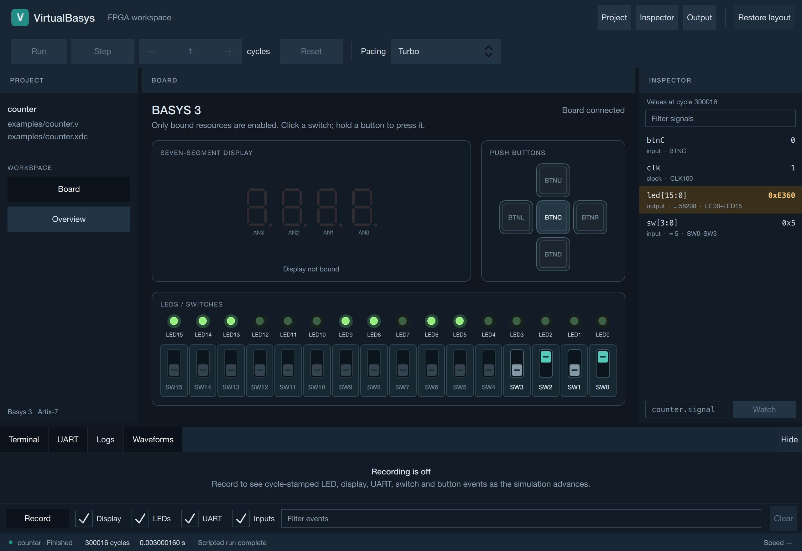
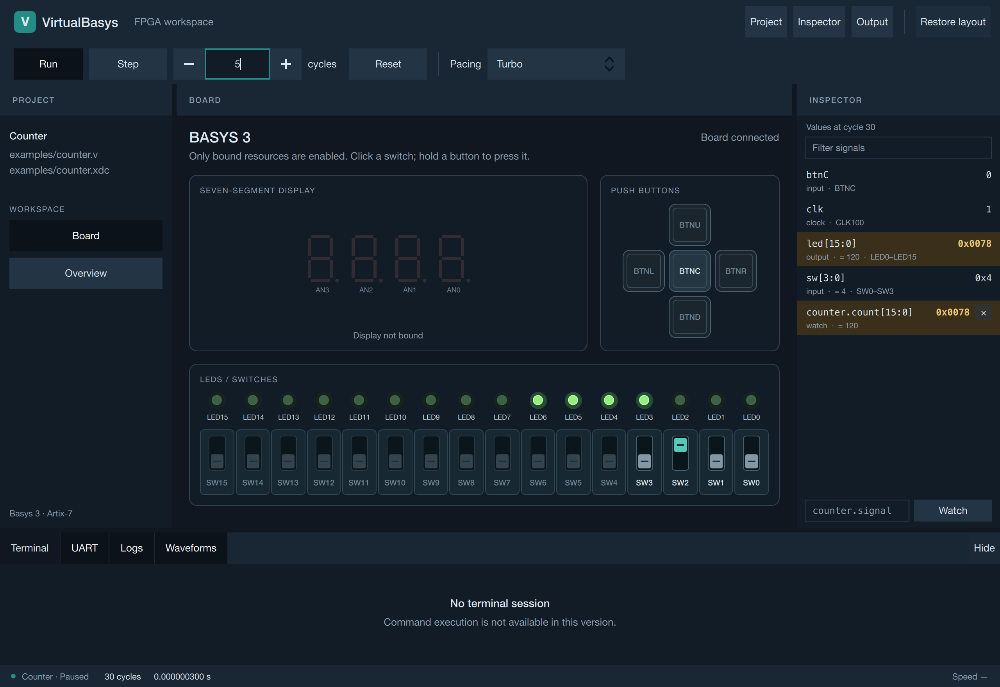
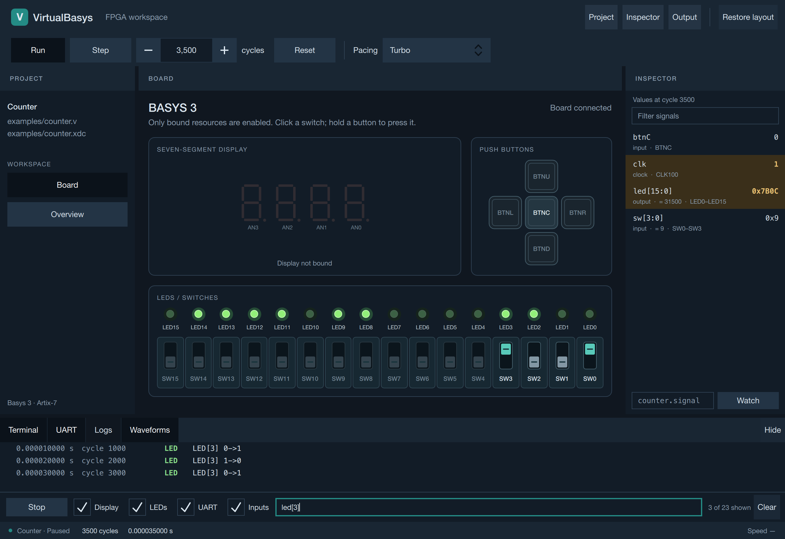
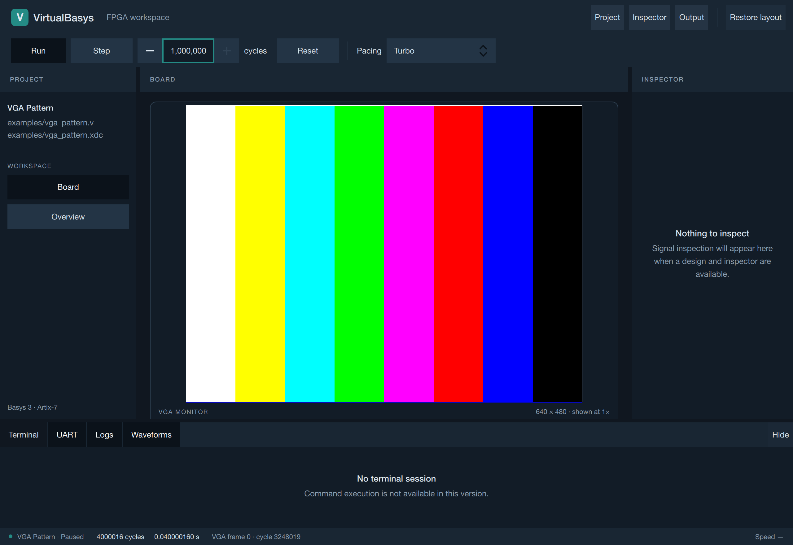
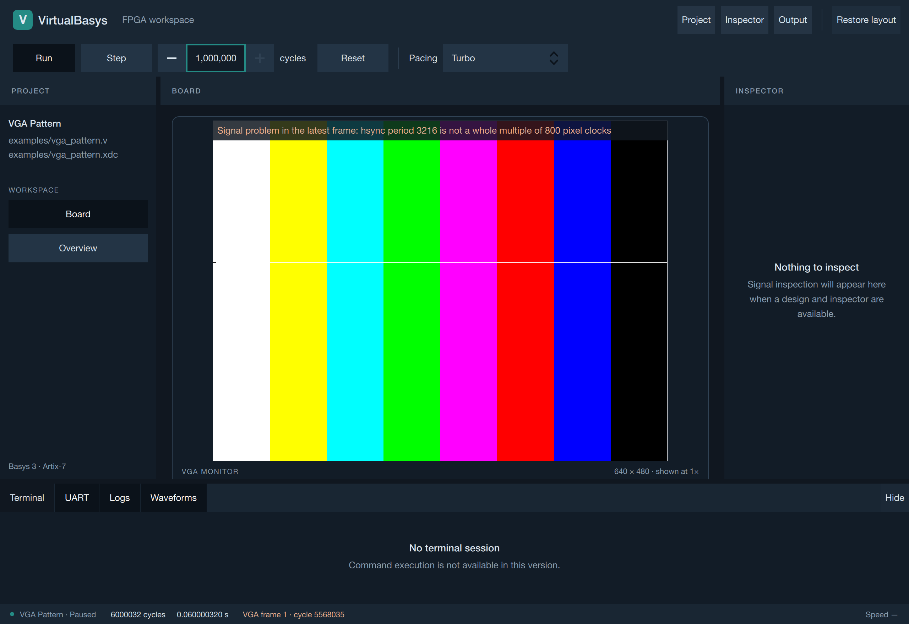
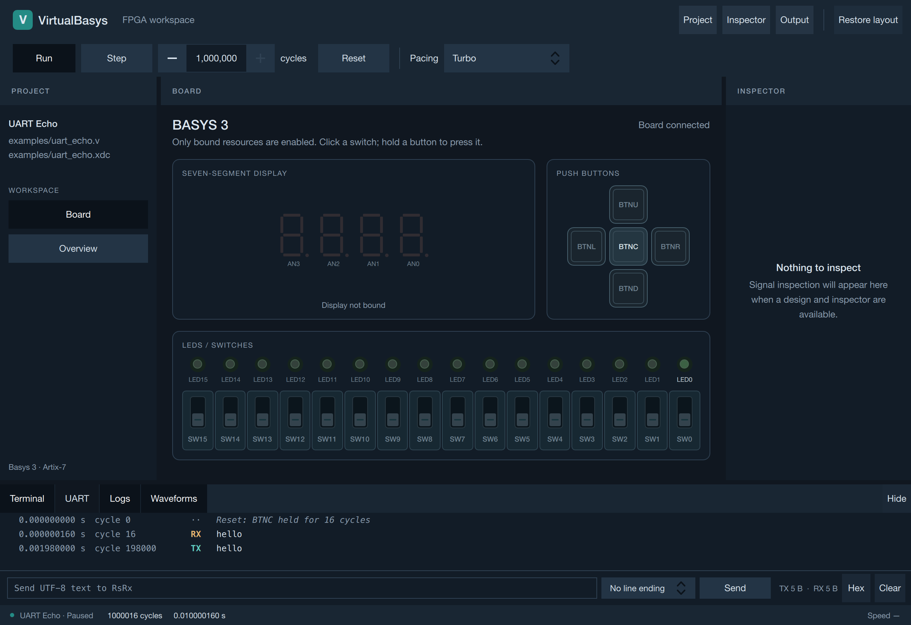
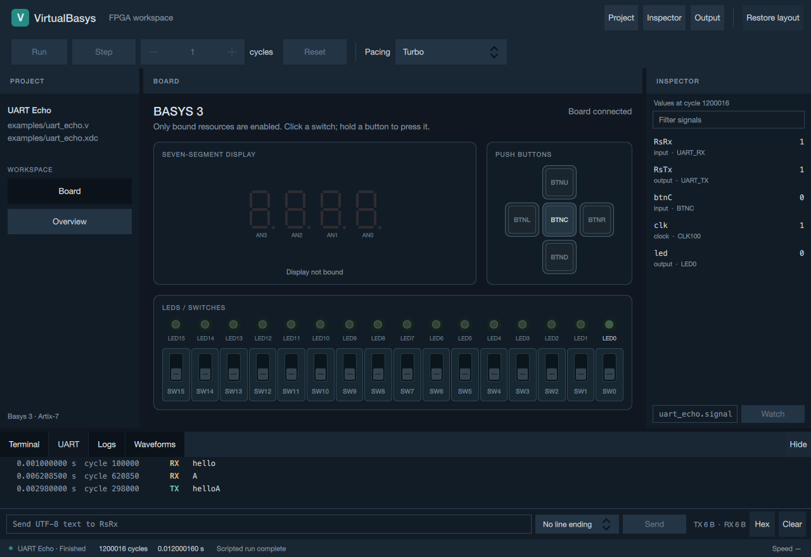
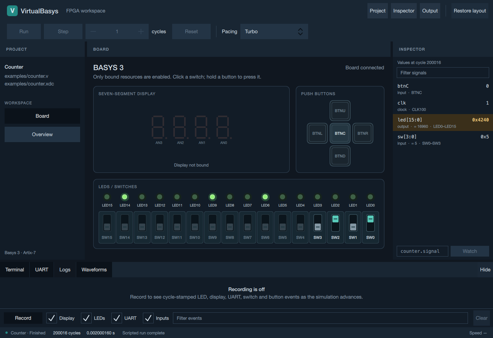
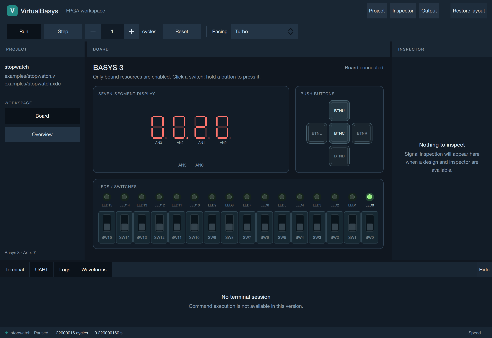

# VirtualBasys

**Run your Verilog and SystemVerilog on a virtual Basys 3 FPGA board, on a Mac,
without the board, Vivado or a VM.**

VirtualBasys compiles a design with Verilator and connects it to a Qt Quick
model of the Digilent Basys 3: 16 switches, 16 LEDs, 5 buttons, the four-digit
seven-segment display, the USB-UART and the VGA port. It reads the same `.xdc`
constraints you give Vivado, keeps exact virtual time (one cycle is 10 ns of the
100 MHz clock), and always shows how fast the simulation is really running.



The counter example, compiled at run time and loaded with its own files in the
Project pane. The app captured this itself with `virtualbasys run
examples/counter.v --xdc examples/counter.xdc --frames 3 --switches 0101
--screenshot out.png`.

## What you can do

- **Run your own design.** `virtualbasys run` takes Verilog-2005 (`.v`) and
  SystemVerilog (`.sv`) sources, compiles them once into a cached module (about
  9 s), and opens them on the board; later runs start in about half a second.
  Verilator's warnings and errors are shown exactly as it prints them, inferred
  latches included.
- **Use your pinout.** Your `.xdc` binds ports to the board by package pin, as
  in Vivado. Without one, the Basys 3 master constraints apply (`clk`, `sw`,
  `led`, `btnC`, `seg`, `an`, `RsRx`, `vgaRed`, ...).
- **Use the board.** Click switches, hold buttons and type into the UART
  terminal. The seven-segment display multiplexes as on the real board, and
  the VGA monitor draws every frame pixel-exactly and reports broken sync
  timing.
- **Look inside.** The inspector shows every port, its pin binding and any RTL
  signal you watch. A cycle-stamped event log records LED, display, UART,
  switch and button events.
- **Control time.** Run, pause, step any number of cycles, or reset. Turbo and
  best-effort real-time pacing never change what the design does; the measured
  speed is always on screen (the stopwatch example runs about 14 million
  cycles per second on Apple Silicon, 0.14× real time).
- **Script it.** `--switches`, `--at CYCLE:INPUT=V`, `--send CYCLE:TEXT`,
  `--frames`, `--log` and `--screenshot` replay a session to the exact cycle,
  for regression tests, grading or bug reports.

## Quick start

On macOS with Xcode Command Line Tools and Homebrew, from the repository root:

```sh
brew install cmake verilator qtbase qtdeclarative
cmake -S . -B build/qt -DVB_BUILD_QT_GUI=ON
cmake --build build/qt -j 8
```

Run your own design, or one of the examples:

```sh
./build/qt/bin/virtualbasys run examples/counter.v --xdc examples/counter.xdc
./build/qt/bin/virtualbasys run top.sv more.sv -I include --top top
```

The four examples also have their own launchers: `virtualbasys_qt` (counter),
`_stopwatch`, `_uart` and `_vga`, in `build/qt/src/qt/`. All open paused; press
Run or Step. A scripted run sets inputs at exact cycles, runs by itself and
writes a log and a screenshot:

```sh
./build/qt/src/qt/virtualbasys_qt_stopwatch --frames 300 \
  --at 100000:BTNU=1 --at 1300000:BTNU=0 --log stopwatch.log --screenshot stopwatch.png
```

Run the tests with `ctest --test-dir build/qt --output-on-failure`. The
[build guide](docs/qt_build.md) and the [board guide](docs/qt_board.md) have the
details.

## How it works

```
your .v / .sv + .xdc
   │
   ├─ Verilator lint + front end, every run: messages, top module, files read
   ├─ design module, built once and cached: your design + Verilator + the engine
   │
SimEngine (step / peek / poke / trace)  ← the only way in to the design
   │
BoardModel: pin binding, switches, LEDs, seven-segment, UART, VGA, virtual time
   │
Qt Quick window: board, controls, inspector, event log, UART terminal, VGA monitor
```

- **One interface.** The window and the board model never touch Verilator
  directly, only the `SimEngine` interface. A second engine, such as the
  planned gate-level one, can slot in behind it.
- **Honest time.** Virtual time is one 64-bit cycle counter owned by the engine.
  Everything on the board is derived from it, so a scripted run gives the same
  log however fast the Mac is.
- **Sound caching.** A compiled module is keyed by the contents of every file
  Verilator read. It is stored only if the build read exactly those files,
  unchanged, so an edit during a compile does not leave a stale design behind.

## How it is tested

- 47 automated tests (19 of them without the GUI), also run under
  AddressSanitizer and UndefinedBehaviorSanitizer.
- Golden logs for every example and a pixel-exact VGA frame. Examples loaded
  through `virtualbasys run` write byte-identical logs to their built-in
  launchers.
- 69 deliberate faults planted in the code that builds, loads and runs your
  designs, each caught by the test written for it.
- Every milestone was reviewed by independent verifiers who tried to break it.

## Screenshots

| Inspector with an RTL watch | Event log filtered to one LED |
| --- | --- |
|  |  |

| VGA pattern in the monitor | Monitor diagnosis after a mid-frame reset |
| --- | --- |
|  |  |

| UART echo in the terminal | Scripted UART sends and their echoes |
| --- | --- |
|  |  |

| Scripted counter run at its last cycle | Stopwatch after simulation |
| --- | --- |
|  |  |

Each screenshot was captured by the app itself, running the examples' real RTL
in the UI tests and benchmarks.

## Status

| Milestone | Status |
| --- | --- |
| Simulator core: engine, XDC binding, board peripherals, VCD traces, golden tests | Done |
| Qt frontend (M0–M8): board, controls, pacing, UART terminal, VGA monitor, inspector, event log, scripted runs | Done |
| Your own designs (M9): `virtualbasys run`, Verilog and SystemVerilog | Done |
| Open and reload designs from the window, with build output (M10) | Next |
| Parallel gate-level engine, RTL-vs-netlist mismatch checker, timing estimate | Planned |

Limits today: designs are simulated cycle by cycle on one master clock, with
two-state logic (no X). Testbenches are not run, only designs on the board. VCD
traces come from the engine, but the window cannot show waveforms yet.
VirtualBasys runs from its build tree and is not packaged for installation.

Documentation: [your own designs](docs/design_loading.md) ·
[scripted runs](docs/qt_scripted_runs.md) · [simulation controls](docs/qt_control.md) ·
[inspector and log](docs/qt_inspector_log.md) · [UART terminal](docs/qt_uart.md) ·
[VGA monitor](docs/qt_vga.md) · [build and testing](docs/qt_build.md) ·
[board guide](docs/qt_board.md) · [roadmap](docs/migration_plan.md)
